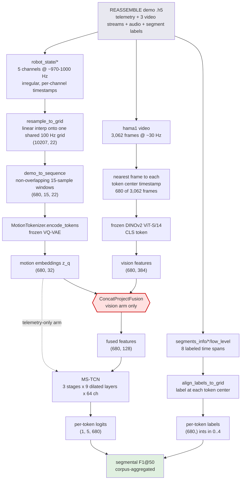
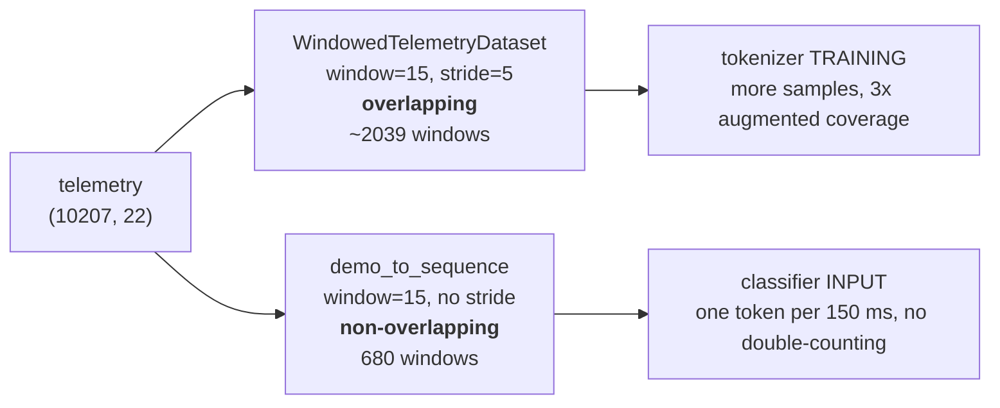
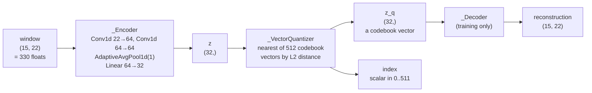
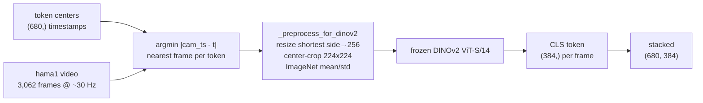
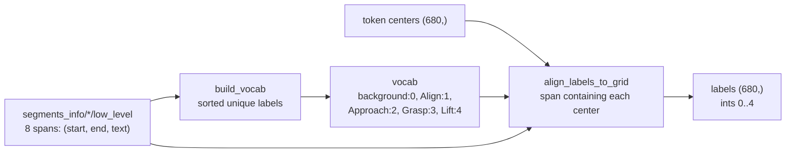
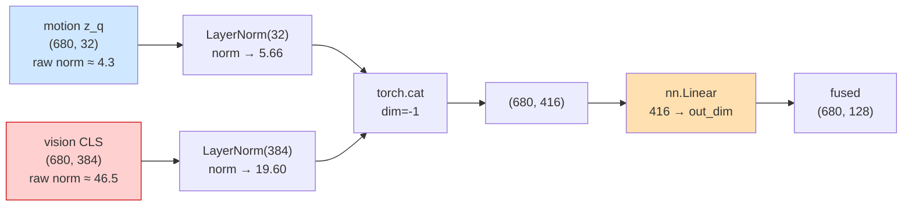
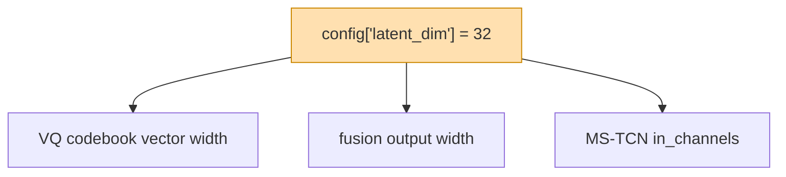
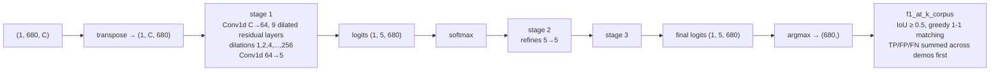
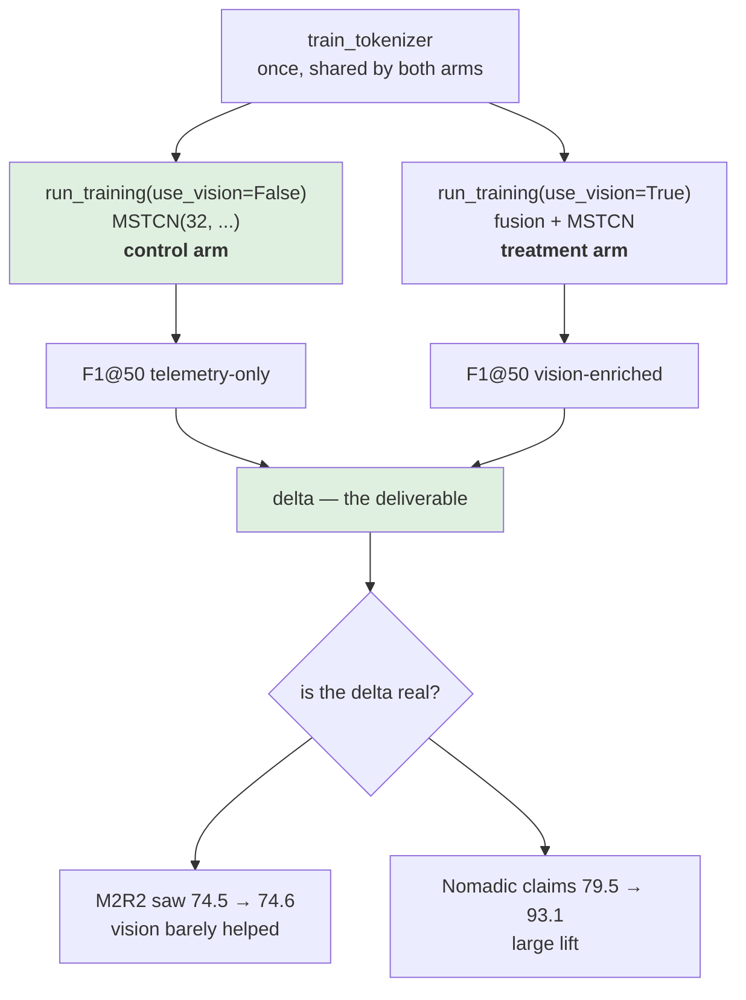

# Pipeline Data Flow

How a raw REASSEMBLE demo becomes a per-token action prediction, with the actual shape of
the data at every hop. Companion to `docs/design.md` (which covers *what* each module is and
why) — this doc covers *what shape the numbers are* as they move.

All concrete shapes below are **measured**, not derived on paper: they come from
`data/reassemble/2025-01-09-13-57-17.h5`, a 102.1-second demo. Other demos differ only in
length; every dimension except the time axis is fixed.

---

## 1. The whole pipeline at a glance



The highlighted node is where the two modalities meet — see §5.

---

## 2. Telemetry → motion tokens

### 2a. Load and resample

Five channels are read from `robot_state/`, each with its own timestamp array and its own
sampling rate. They do not share a clock:

| channel | raw shape | rate |
|---|---|---|
| `joint_positions` | (99044, 7) | ~970 Hz |
| `joint_velocities` | (99044, 7) | ~970 Hz |
| `gripper_positions` | (99044, 2) | ~970 Hz |
| `measured_force` | (102088, 3) | ~1000 Hz |
| `measured_torque` | (102088, 3) | ~1000 Hz |

`resample_to_grid` picks the overlap window `[max(starts), min(ends)]`, builds one uniform
**100 Hz** grid over it, and `np.interp`s every column onto it. The five channels concatenate
column-wise into a single feature axis:

```
7 + 7 + 2 + 3 + 3 = 22 channels
```

**Result: `(10207, 22)` float32, plus a `(10207,)` timestamp grid.**

Note the deliberate downsample: ~1000 Hz → 100 Hz. The design doc records that the original
spec assumed ~20 Hz and real inspection found ~970-1000 Hz; 100 Hz is the chosen grid.

### 2b. Windowing — and the one asymmetry worth knowing

The telemetry gets cut into windows **twice, differently**, depending on the purpose:



Same window length (15 samples = **150 ms**), different stride. Training the VQ-VAE wants
maximum sample count, so it strides by 5. The classifier wants a clean non-overlapping
sequence where token *i* covers a distinct slice of time, so it strides by the full window.
Both use the same `mean`/`std` normalization stats, saved in the tokenizer checkpoint.

**Classifier-path result: `(680, 15, 22)` windows + `(680,)` center timestamps.**

### 2c. Quantize



The compression is severe and intentional: **330 raw numbers → one of 512 discrete codes**
(9 bits), with the 32-dim codebook vector `z_q` as its continuous stand-in. The decoder
exists only to supply the reconstruction loss during tokenizer training; at classifier time
the tokenizer is frozen and only `encode_tokens` runs.

The classifier consumes `z_q` (the continuous codebook vector), **not** the integer index —
so the 32-dim geometry of the codebook is what the downstream model actually sees.

**Result: `(680, 32)` motion embeddings.**

---

## 3. Video → vision features



Vision is sampled **down to the token rate**, not the other way round: 680 of the 3,062
available frames get encoded (token rate is 6.67 Hz vs the camera's ~30 Hz). One frame per
token, chosen by nearest timestamp. The remaining ~78% of frames are never touched.

Three cameras (`hama1`, `hama2`, `hand`) and three audio streams exist in the file; we use
`hama1` only, and never touch audio at all — tracked as a known difference from M2R2, which
does use audio.

DINOv2 is frozen: no gradients, `requires_grad_(False)`. **The only trainable thing in the
entire vision pathway is the fusion projection.**

Extraction streams rather than materializing frames: each wanted frame is decoded,
preprocessed, pushed into a batch buffer of 32, and discarded, so peak RAM is O(batch), not
O(demo length) — measured flat at ~85 MB whether 300 or 1,200 frames are requested. Results
are cached to disk under `cache_dir`, keyed on demo + camera + the exact frame-index list,
so repeat runs skip the encoder entirely.

**Result: `(680, 384)` float32.**

---

## 4. Labels → per-token targets



This demo has 8 low-level segments drawing on 4 distinct labels: `Align`, `Approach`,
`Grasp`, `Lift`. Any token whose center falls outside every labeled span becomes
`background` (class 0) — 46% of tokens on *this* demo, but only **1.8% corpus-wide**: this
demo is unusually sparsely labeled. Across all 148 demos the vocabulary is 10 classes and the
real imbalance is 33:1 between Grasp and Nudge. See `docs/hyperparameters.md`.

Only **low-level** labels are used. The high-level ones in the same file ("Pick Ethernet")
are task- and object-specific and would not generalize the way this vocabulary is meant to.

---

## 5. The fusion junction

This is the only place the two modalities meet, and the only trainable link in the vision
path (`enrichment/fuse.py`):



Two things about this junction are load-bearing for the project's central question, and
both were fixed after review found them:

**The branches used to enter ~11-26x apart in scale.** `nn.Linear` initializes all 416 input
weights from one distribution — it has no idea which dims are which modality — so each
branch's contribution to the output scales with its **vector norm**. The raw norm ratio was
the branch-dominance ratio, one to one, at initialization and in the gradients. Worse, it was
not even a stable quantity: it drifts with the tokenizer checkpoint (measured 10.8x on one
3-epoch tokenizer, 25.7x on another), so the branch balance was not reproducible run to run.

**The output width used to be pinned to the wrong hyperparameter.** `train.py` built it as
`ConcatProjectFusion(latent_dim, 384, latent_dim)` — so the fusion's output width was the
*tokenizer's codebook width*. That made `latent_dim` do three unrelated jobs at once:



Which meant a sweep over `latent_dim` would move the motion representation, the fusion
bottleneck, and the classifier's input capacity simultaneously — confounded by construction.
With `out_dim` independent, only `J1` remains, so a `latent_dim` sweep now varies one thing.

### Why per-branch, and not one LayerNorm over the concat

Normalization must be applied **per branch, before the concat**. A single `LayerNorm(416)`
after the concat applies one shared scalar to both halves and so barely moves the ratio:

Measured on the test fixture, which reproduces the originally-reported scales:

| | motion norm | vision norm | ratio |
|---|---|---|---|
| no normalization (the bug) | 1.83 | 47.1 | **25.8x** |
| one `LayerNorm(416)` after concat | — | — | **24.3x** — no real effect |
| `LayerNorm(384)` on vision only | 1.83 | 19.6 | 10.7x |
| **`LayerNorm` on both branches (shipped)** | 5.66 = √32 | 19.6 = √384 | **3.46x** = √12 |

LayerNorm pins a branch's L2 norm to exactly √d regardless of what came in, which is what
makes the ratio predictable. The residual 3.46x in the last row is pure dimensionality —
vision has 12x more dims — and `gamma` is learnable, so the model can re-weight from there.

> **Status: implemented.** Both branches are LayerNorm'd separately before the concat, and
> `out_dim` is now an independent `run_training(fusion_out_dim=...)` parameter defaulting to
> 128. Measured on real data, the output-contribution imbalance went from 11.2x to 3.62x.
> See the "Vision/motion embedding scale mismatch" entry in
> `docs/differences-from-published-results.md` for the full before/after table.

---

## 6. Classifier and metric



`C` is the pipeline's fork point: **32** on the telemetry-only arm (raw `z_q`), the fusion
output width on the vision arm. Stacked dilations 1…256 with kernel 3 give a receptive field
of `1 + 2·(1+2+…+256)` = **1,023 tokens ≈ 153 s** per stage — longer than this entire 102 s
demo, so in practice every token is classified with full-demo context.

Batch size is one demo. The loss sums cross-entropy across all three stages.

---

## 7. The ablation this all exists to serve



Both arms share one tokenizer checkpoint and one vocabulary — `compare.py` passes the
control arm's vocab into the treatment arm explicitly so the label spaces cannot drift.

**The control arm must stay behaviorally frozen.** Any change to the `use_vision=False` path
invalidates the comparison, which is why fusion changes have to be confined to the
`use_vision=True` branch.

---

## 8. Dimension quick reference

| symbol | value | where set | notes |
|---|---|---|---|
| telemetry channels | 22 | `TELEMETRY_CHANNELS`, `tokenizer/data.py` | 7+7+2+3+3 |
| grid rate | 100 Hz | `RATE_HZ` | resampled down from ~970-1000 Hz |
| window | 15 samples = 150 ms | `train_tokenizer(window=)` | our choice |
| tokenizer train stride | 5 | `WindowedTelemetryDataset` | overlapping |
| classifier stride | 15 (none) | `demo_to_sequence` | non-overlapping |
| `latent_dim` | 32 | `MotionTokenizer` default | **ours, untuned** |
| `num_codes` | 512 | `MotionTokenizer` default | measured utilization 0.235 — 9 codes live |
| `VISION_FEATURE_DIM` | 384 | `enrichment/vision_features.py` | dinov2_vits14 CLS |
| fusion out_dim | 128 | `run_training(fusion_out_dim=)` | independent of `latent_dim` |
| MS-TCN channels / layers / stages | 64 / 9 / 3 | `run_training` defaults | ours |
| num classes | 5 on this demo | `build_vocab` | background + observed labels |
| tokens per demo | 680 here | `len(telemetry) // 15` | scales with demo length |

None of the "ours" rows are reproductions of a published configuration — Nomadic's blog
discloses no architecture specifics. See `docs/differences-from-published-results.md`.
