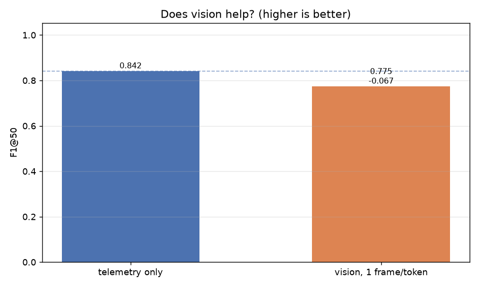
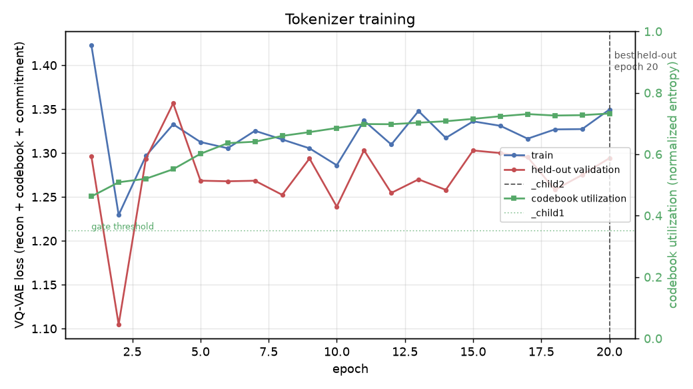
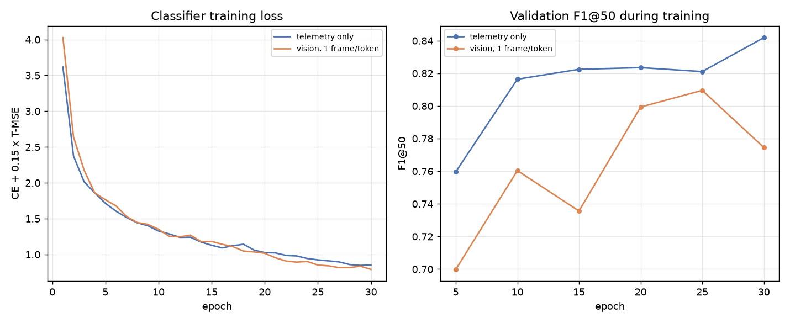

# v1 — first run to produce a real answer

Source run: `runs/20260911-114547`. Raw artifacts in `data/`, figures in `images/`.
Reference targets and known divergences live in
`docs/differences-from-published-results.md`; this doc is the numbers themselves.

Numbering: `v1`, `v2`, ... one per run that produced a usable result. Aborted and failed
attempts are not numbered; they stay in `runs/` with a `status.json` saying why.

**Status: arms 1 and 2 complete, arm 3 (pooled vision) pending.** Scored on the 22-demo
**validation** split, not the held-out test split. Nothing here is comparable to published
numbers yet.



### Headline

| arm | F1@50 (final epoch) | F1@50 (best epoch) | delta vs control |
|---|---|---|---|
| telemetry only *(control)* | **0.8419** | 0.8419 @30 | — |
| vision, 1 frame/token | **0.7746** | 0.8096 @25 | **-0.0673** / -0.0323 |
| vision, pooled over window | pending | pending | pending |

**Vision made temporal action segmentation worse.** Directionally consistent with M2R2's
ablation (74.5% → 74.6%, vision barely helping in their late-fusion design), but we measured
an actual degradation rather than a wash. Nowhere near Nomadic's claimed 79.5% → 93.1%.

### Provenance

- git `c46aec7`, torch 2.11.0+cu128, RTX PRO 1000 Blackwell (8 GB)
- 89 train / 22 validation / 37 test demos, from REASSEMBLE's official `split1`
- tokenizer fingerprint `c0c24bcfd26cbbe6`, 20 epochs, 512 codes, 32-dim latent, 150 ms window
- classifier: MS-TCN 3 stages x 9 layers x 64 ch, 30 epochs, CE + 0.15·T-MSE
- **no seed** — this run predates seeding, so it is not exactly reproducible

### Tokenizer that produced it



Loss and codebook utilization are plotted on twin axes deliberately: they move in *opposite*
directions. Total VQ-VAE loss falls when the codebook collapses, so the loss curve alone is
actively misleading about tokenizer quality. The dotted line is the 0.35 gate threshold.

| check | value | verdict |
|---|---|---|
| reconstruction error | 0.3548 | reported, no threshold |
| codebook utilization | 0.725 (~92 of 512 effective codes) | **pass** (floor 0.35) |
| boundary f1 | 0.192 (recall 0.598, precision 0.115) | — |
| boundary lift over chance | +0.129 (chance 0.468) | **pass** (>0) |
| segment purity | 0.501 | — |

Boundary precision of 0.115 is the weak spot and it reproduces across runs (0.118 in an
earlier one): only ~12% of token changes land near a real action boundary, so the tokenizer
carves far more finely than the actions it is meant to track. That is a plausible ceiling on
F1@50 for *both* arms, independent of vision.

---

## What the per-epoch curves say, which the headline number hides



| epoch | telemetry loss | telemetry F1 | vision loss | vision F1 |
|---|---|---|---|---|
| 5 | 1.7137 | 0.7597 | 1.7637 | 0.6998 |
| 10 | 1.3268 | 0.8164 | 1.3523 | 0.7604 |
| 15 | 1.1285 | 0.8225 | 1.1820 | 0.7356 |
| 20 | 1.0262 | 0.8235 | 1.0170 | 0.7993 |
| 25 | 0.9243 | 0.8211 | 0.8517 | 0.8096 |
| 30 | 0.8530 | **0.8419** | **0.7913** | 0.7746 |

Two things matter here:

**1. The vision arm fits the training data BETTER and generalizes WORSE.** Final training
loss 0.7913 with vision against 0.8530 without, while validation F1 goes the other way. That
is the signature of overfitting, not of an unhelpful feature: the 384 extra input dimensions
give the classifier capacity to memorize rather than information that transfers. An
uninformative-but-harmless feature would leave both curves roughly unchanged; this actively
traded generalization for fit.

**2. The reported delta depends on an arbitrary stopping point.** We report the final epoch.
The vision arm peaked at 0.8096 on epoch 25 and fell to 0.7746 by epoch 30, and its curve is
visibly noisier throughout (0.700 → 0.760 → 0.736 → 0.799 → 0.810 → 0.775) than the control's
near-monotone climb. So:

- delta at the final epoch: **-0.0673**
- delta at each arm's best epoch: **-0.0323**

Both negative, so the direction of the conclusion is stable. The magnitude is not — it
roughly halves. **There is no early stopping or best-epoch selection for the classifier**;
`run_training` reports whatever epoch 30 happened to produce. Both arms are treated
identically so the comparison is fair, but the number is more fragile than one figure
suggests. This is the same mistake found and fixed in the tokenizer, still present here.

---

## Why this run is more trustworthy than any before it

Five earlier attempts produced no usable number. Each failure bought a fix, and five of those
fixes bear directly on whether this result means anything:

| fix | why it mattered to this number |
|---|---|
| **Fusion branch normalization** | Vision entered the fusion layer ~11-26x louder than motion, which biased the comparison *toward* vision helping or hurting unpredictably. Now 3.46x, per-element parity. Without this, "vision hurt" could just have been "the fusion layer was miswired." |
| **DINOv2 preprocessing** | Frames were squashed to 224x224 with no ImageNet normalization. Degraded features bias directly toward "vision doesn't help" — exactly the result we measured, so this had to land first. |
| **Corpus-level F1@50** | The original macro-averaged per-demo, which is not the protocol Nomadic/M2R2 report. |
| **T-MSE smoothing loss** | Cross-entropy alone has no objection to a prediction flipping class between neighbouring tokens; F1@50 punishes it heavily. Both arms now train on MS-TCN's actual objective. |
| **Tokenizer gates on held-out demos** | A collapsed codebook (measured: 8 of 512 effective codes) would have starved *both* arms. This run's tokenizer was verified healthy before a single classifier epoch ran. |

Plus the protocol hygiene that makes it a measurement rather than an anecdote: a real
validation split with `test_split1` untouched, per-run directories holding config,
checkpoint, logs and results, and per-arm persistence.

---

## What could still change the answer

Ordered by how much they could move it.

1. **Reproducibility is unmeasured.** One run. The delta is -0.067 and we cannot yet say
   whether run-to-run variance is ±0.01 or ±0.10. Until repeats exist this number has no
   error bar. Seeding has landed; the study has not run.
2. **No classifier early stopping.** Halves the delta depending on where you stop (above).
3. **Vision is temporally subsampled, not aggregated.** Each token gets one still photo, so
   the vision branch structurally cannot contribute motion information — only scene context.
   Arm 3 (pooled over the window) tests exactly this and has not run.
4. **The frame-invariant component of the DINOv2 feature.** ~87% of the CLS token's magnitude
   is constant across frames; LayerNorm rescales but does not remove it. Per-dimension
   standardization over training frames is the next escalation.
5. **Codebook initialization.** `uniform_(-1/num_codes, 1/num_codes)` starts all 512 codes
   within ±0.002 of the origin while encoder outputs sit at radius ~0.59 — measured, only 2
   of 512 codes win at init. Roughly the first 10 epochs are spent undoing this rather than
   learning motion. Affects both arms equally, but caps the representation both depend on.
6. **Boundary precision 0.115.** The tokenizer changes token far more often than actions
   change. Both arms inherit this ceiling.
7. **Validation is not test**, and the splits are not distributionally identical (`Align`
   13.40% train vs 18.35% val; `Pull` 5.79% train vs 7.88% test).

## Why vision plausibly hurt

Not a settled explanation; the candidates, in the order the evidence supports them:

- **Capacity without information.** Best supported: the vision arm fits training data better
  and generalizes worse. 384 extra dimensions against ~199k training tokens and 10 classes.
- **Static context is the wrong signal for segmenting motion.** One frame per token can say
  *what is in view*, never *what is moving*. Action boundaries are dynamic events. Telemetry
  already carries the dynamics, so vision may be adding scene identity the classifier does
  not need and can overfit to.
- **Camera is static and the scene changes slowly**, so adjacent tokens' vision features are
  near-duplicates, adding correlated noise rather than discriminative signal.

Arm 3 discriminates between the first two: if pooling frames over the window (which adds
short-horizon visual dynamics) recovers the gap, the problem was subsampling. If it does not,
the problem is capacity or relevance.

---

## Superseded runs

| run | outcome |
|---|---|
| Sept 9, two runs | Predate per-run directories. First: arm 1 trained, score lost (printed only at the end). Second: killed to fix logging. |
| `20260910-145157` | Stalled at tokenizer epoch 17/20, marked SYSTEM_FAILURE. Later attributed to the laptop running on battery with the GPU clamped to 180 MHz / 15 W. |
| `20260911-104521` | Killed at epoch 11, cause unknown, stderr discarded. Checkpoints survived. |
| `20260911-113845` | Gate FAILED (8 effective codes) after resuming from a "best loss" checkpoint. Cost one minute and revealed that VQ-VAE loss anti-correlates with codebook health. |

**A note on every wall-clock number produced before ~13:22 on 2026-09-11:** the laptop was on
battery and the GPU was clamped to 180 MHz / 15 W. Identical work measured 601.7 s throttled
and 24.0 s on AC — 25x. Classifier epochs: ~17 s throttled, 0.8 s on AC. Accuracy numbers are
unaffected; timings from that period are not comparable to anything. Run configs now record
`pstate`, `clocks.sm` and the enforced power limit alongside every measurement.


---

## Files in this folder

| path | what it is |
|---|---|
| `images/f1_comparison.png` | F1@50 per arm with the delta against the control |
| `images/classifier_training.png` | per-arm training loss and validation F1@50 during training |
| `images/tokenizer_training.png` | tokenizer loss and codebook utilization per epoch, gate threshold marked |
| `data/config.json` | git commit, torch version, command line, every hyperparameter, full demo membership of all three splits |
| `data/results.json` | each arm's F1@50, wall time, and complete per-epoch history |
| `data/tokenizer_report.json` | the three gate metrics on held-out demos |
| `data/tokenizer_history.json` | per-epoch tokenizer train/held-out loss and codebook utilization |
| `data/run.log` | full timestamped run log |

Regenerate the figures from any run directory with:

```bash
python -m temporal_classifier.plots runs/<run-id> --out-dir results/<version>/images
```
